# Event Buddy Project 

Event Buddy is a modern mobile application developed using React Native and Expo, designed to help users discover, explore, and manage events with ease. The app provides a user-friendly interface where individuals can view upcoming events, check detailed information, and save their favorites for quick access.

Authentication is seamlessly integrated using Firebase, enabling users to sign up, log in, recover their password, and manage their profiles securely. The app uses React Navigation with both stack and tab navigators for smooth transitions between screens.

With a focus on user experience and simplicity, Event Buddy also includes visual feedback for errors, validations during sign-up and login, and real-time updates to user preferences. Whether you're an event-goer looking to stay updated or just exploring what's happening around, Event Buddy offers a clean, responsive, and efficient solution.

## 🚀 Getting Started

### 📦 Requirements

- Node.js (>= 14)
- npm or yarn
- Expo CLI (`npm install -g expo-cli`)
- Firebase account (for backend services)

### 🔧 Installation

1. Clone the repository:
```bash
git clone https://github.com/WendyVelasquez/EventBuddyProject.git
cd EventBuddyProject
```

2. Install dependencies:
```
npm install
```

3. Start the project:
```
expo start
```

### 🔑 Firebase Setup

Create a project on Firebase Console
Enable Email/Password authentication under Authentication > Sign-in method
Copy your Firebase configuration into the firebaseConfig.js file:

```
// firebaseConfig.js
export const firebaseConfig = {
  apiKey: "YOUR_API_KEY",
  authDomain: "YOUR_AUTH_DOMAIN",
  projectId: "YOUR_PROJECT_ID",
  storageBucket: "YOUR_STORAGE_BUCKET",
  messagingSenderId: "YOUR_SENDER_ID",
  appId: "YOUR_APP_ID"
};
```
### 🧱 Project Structure
```
├── assets/               # App icons and images
├── navigation/           # Navigation setup (stack and tab)
├── screens/              # Main app screens
├── services/             # Firebase and other services
├── styles/               # Global styles
├── App.js                # Main entry component
├── firebaseConfig.js     # Firebase credentials
├── README.md             # Project documentation
```
### 🧪 Features

- 🔐 **Secure Authentication**  
  User registration, login, and password recovery are implemented using Firebase Authentication, ensuring data security and ease of access.

- 📋 **Event Listing & Details**  
  Users can explore a list of available events and view detailed information such as title, location, description, and image.

- ⭐ **Favorites Management**  
  Users can save events to a personalized favorites list for quick access and future reference.

- 👤 **Profile Management**  
  Authenticated users can view and update their profile information directly within the app.

- 🔁 **Intuitive Navigation**  
  Seamless navigation using React Navigation with both stack and tab navigators, providing a smooth and organized user experience.

- ✅ **Form Validation & Error Feedback**  
  Real-time input validation and informative error messages during login, signup, and recovery processes.

- 📱 **Responsive & Clean UI**  
  A user-friendly interface optimized for mobile devices, built with a focus on clarity and accessibility.


## 📸 Screenshots

<h3>🔐 Login Screens</h3>
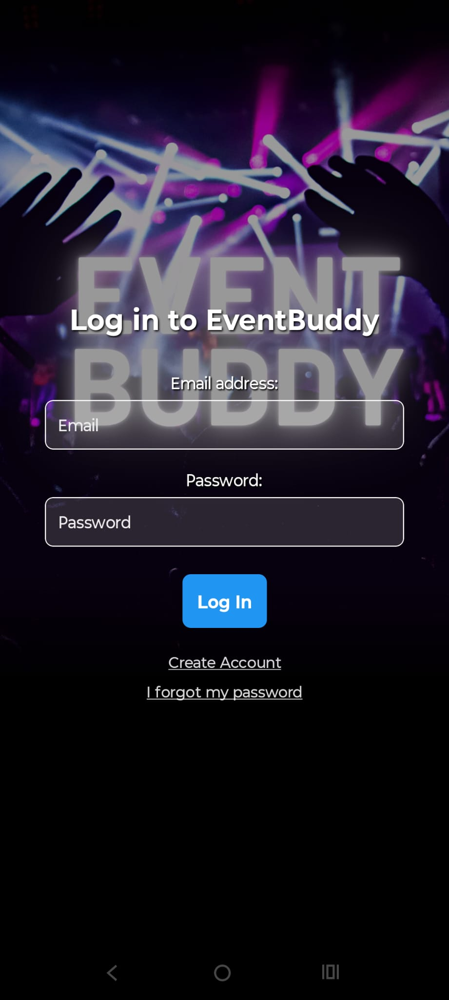

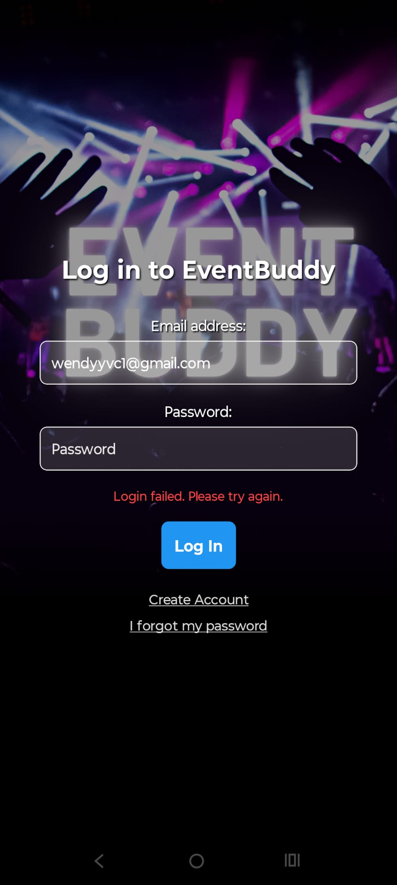

<h3>📝 Sign Up Screens</h3>
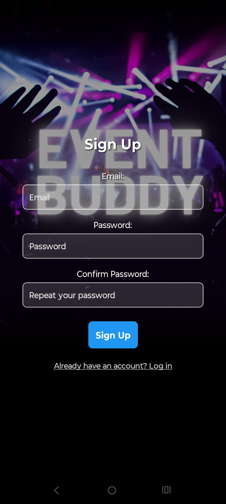
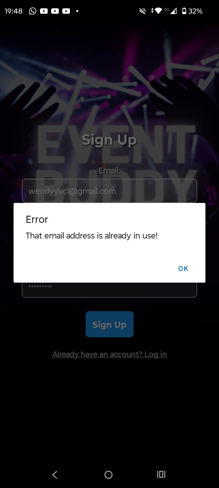
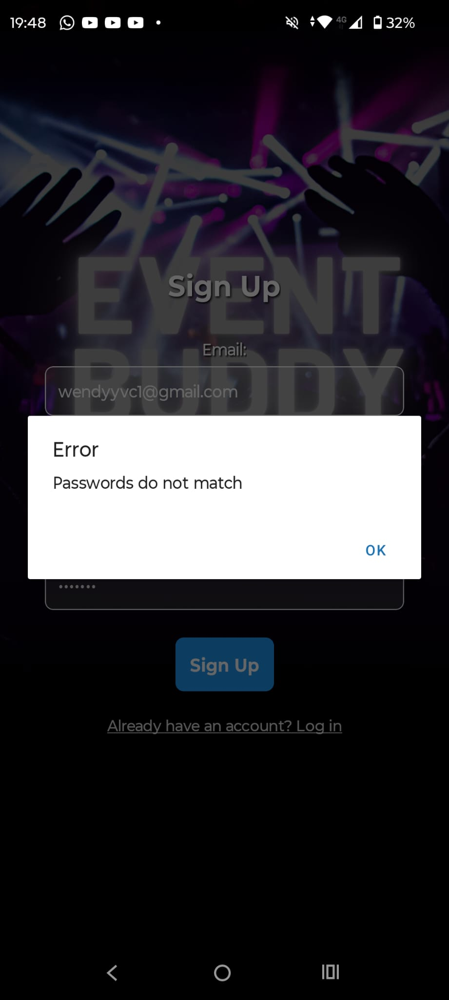
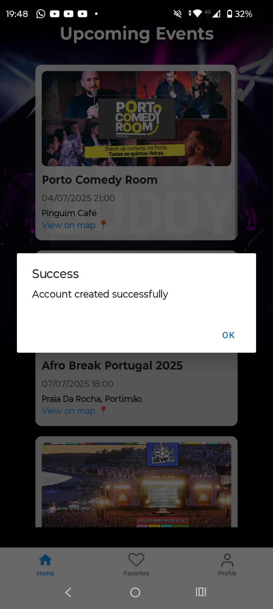

<h3>🔁 Recovery Screens</h3>
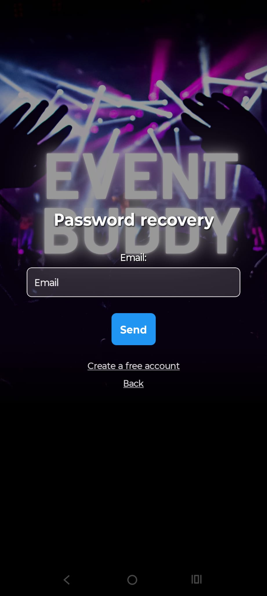

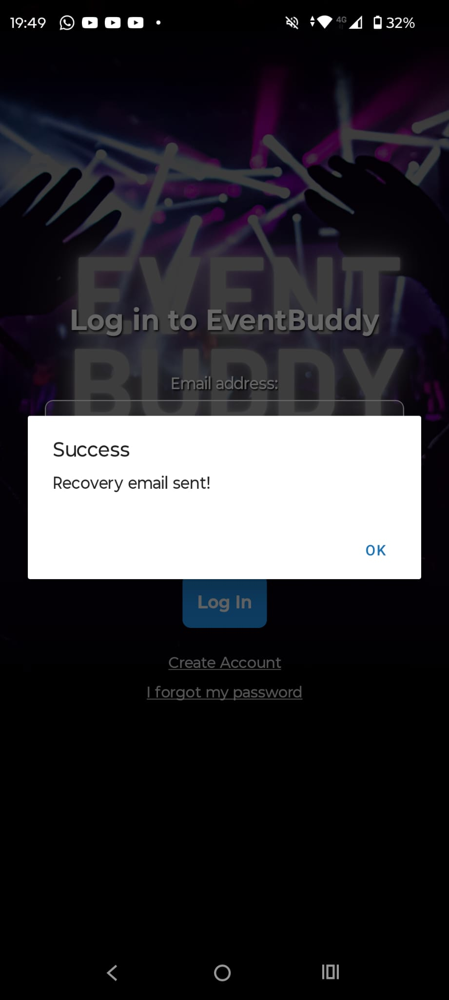

<h3>🎫 Events Screens</h3>
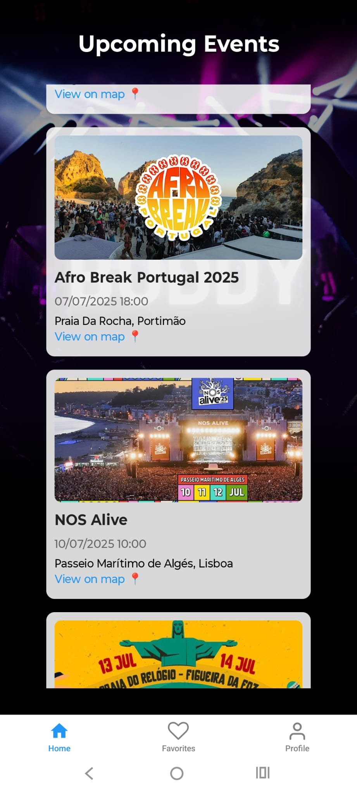
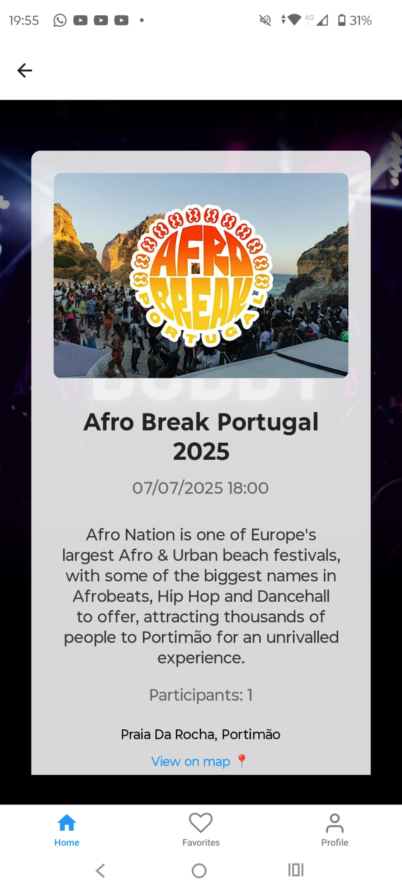
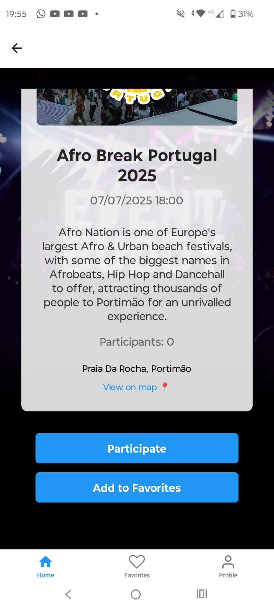

<h3>⭐ Favorites Screen</h3>
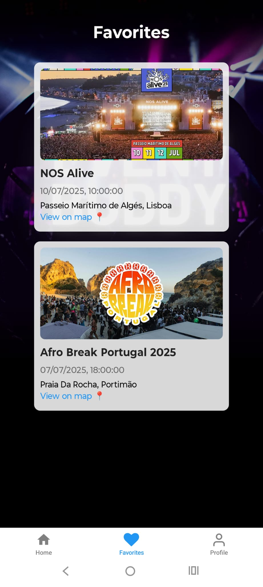

<h3>👤 Profile Screens</h3>
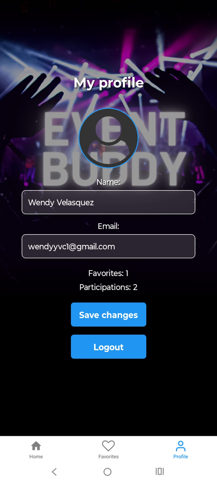
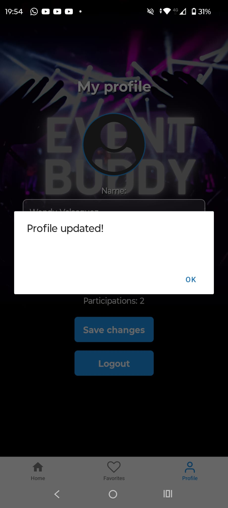


### 📚 Main Dependencies
- React Native
- Expo
- Firebase
- React Navigation

### 👩‍💻 Author
**Wendy Cuellar**  
[LinkedIn](https://www.linkedin.com/in/wendyvelasquez20/) | [GitHub](https://github.com/WendyVelasquez)

### 📃 License
This project is licensed under the MIT License.

---